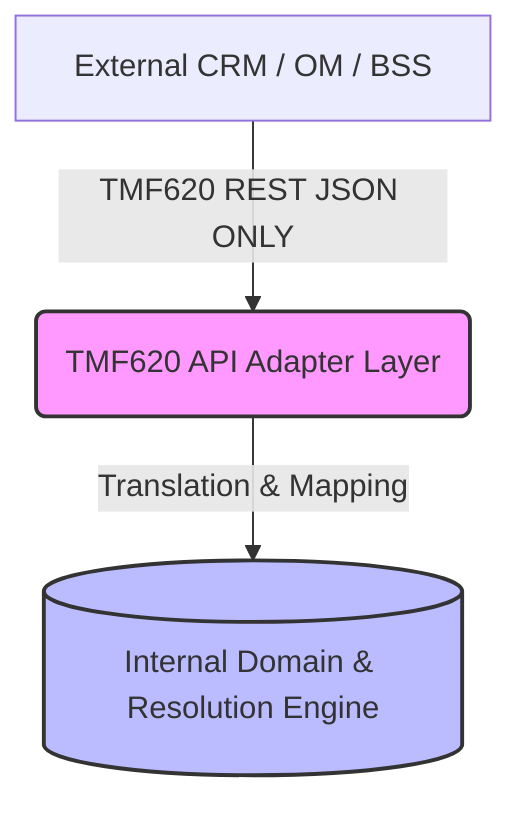

# Telecom Product Catalogue Engine (v2)


A standalone, plug-and-play, multi-tenant, and multi-market **Product Catalogue Engine** built for modern telecom operators. 

This engine defines commercial configuration (what can be sold, to whom, where, and for how much) and exposes it externally via **TM Forum Open APIs (TMF620)**. It is specifically designed so that *any* external CRM, Order Management (OM), or Business Support System (BSS) can consume the catalogue without needing to understand the complex internal schema.

---

## 🏛 Architecture: The Two-Layer Approach

This system enforces a strict separation of concerns to prevent domain leakage.



1. **Internal Domain Engine:** A PostgreSQL-backed modular monolith. The internal schema is heavily normalized, completely isolated by tenant, and strictly enforces commercial rules (e.g., cardinality, charge priority, immutability of released versions). 
2. **TMF620 Adapter Layer:** A strict boundary layer (built in Node.js/Express) that maps internal state to `ProductSpecification`, `ProductOffering`, and `ProductOfferingPrice` on the way out. **No internal concepts or raw table columns ever leak into the API responses.**

---

## ✨ Key Features & Technical Guarantees

* 🏢 **True Multi-Tenancy:** `tenant_id` is present on every table. Cross-tenant leakage is mathematically impossible due to strict composite Foreign Keys (`tenant_id`, `id`) and Row-Level Security readiness.
* 🔒 **Strict Immutability:** Catalogue versions follow a strict `DRAFT -> APPROVED -> RELEASED -> RETIRED` lifecycle. PostgreSQL triggers physically block any edits to the core data of a `RELEASED` catalogue.
* 🧩 **TMF-Aligned Product Domain:** `product_specification` acts as the pure grouping root, completely separated from internal provisioning or charging logic.
* ⚙️ **Service Cardinality Enforcement:** `offering_service_component` enforces mandatory/optional rules (`mandatory_flag`) and strict `min_qty`/`max_qty` limits directly at the database level.
* 💰 **Deterministic Charging:** Internal `charge_specification` tables support dynamic stacking rules (`ADDITIVE`, `OVERRIDE`) and calculation types (`FLAT`, `PERCENTAGE`) without polluting the external TMF schema.

---

## 📂 Repository Layout

```text
telecom-product-catalogue/
├── docs/                 # Architecture, domain models, and TMF alignment decisions
├── database/
│   ├── migrations/       # Sequential PostgreSQL DDL scripts (Up & Down)
│   └── tests/            # PL/pgSQL anonymous blocks for constraint testing
├── backend/
│   ├── api/tmf620/       # The external TMF620 adapter layer (Node.js/Express)
│   ├── domain/           # Internal core models
│   ├── repositories/     # Data access layer (pg)
│   └── services/         # Business logic & orchestration
└── docker-compose.yml    # (Optional) Local infrastructure spin-up
```

---

## 🚀 Getting Started (Local Development)

### Prerequisites
* **PostgreSQL (v14+)**: Running locally.
* **Node.js (v24+)**: For the backend adapter layer.

### 1. Database Setup
We use sequential SQL migrations. Open your SQL client (e.g., **DBeaver**) and connect to your local database instance.
Execute the migrations in the `database/migrations/` folder in numerical order:
1. `001_initial_catalogue.up.sql`
2. `002_product_specification_and_offering.up.sql`
3. `003_cross_tenant_integrity.up.sql`
4. `004_service_specification.up.sql`
5. `005_charge_specification.up.sql`

*Note: You can verify the schema integrity by running the corresponding scripts in `database/tests/` via DBeaver (`Alt + X`). If the constraints are working correctly, the scripts will print `All tests passed successfully`.*

### 2. Backend Adapter Layer
The backend is a TypeScript Node.js service that acts as the TMF620 translator.

```bash
# Navigate to the backend directory
cd backend

# Install dependencies
npm install

# Run the strict adapter-layer tests
npx jest
```

If everything is configured correctly, the tests will successfully map the internal data to the exact TMF620 JSON structures without leaking any internal fields.

---

## 📖 Documentation Reference

Before contributing, please read the core architecture rules:
* [AGENTS.md](./AGENTS.md) - The non-negotiable master rulebook for the system.
* [Domain Model](./docs/domain-model.md) - Internal vs. TMF schemas.
* [TM Forum Alignment](./docs/tmforum-alignment.md) - How we bridge the gap to the industry standard.
