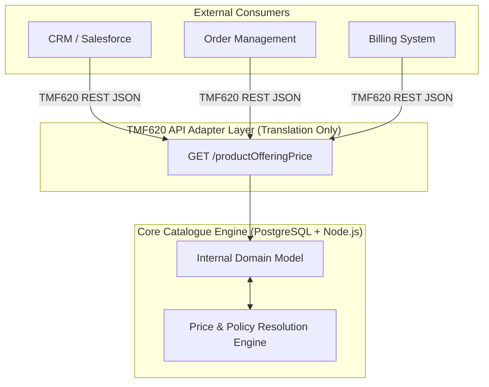

<div align="center">

# 🚀 Telecom Product Catalogue Engine

**Enterprise-Grade. Multi-Tenant. TMF620 Compliant. Plug-and-Play.**

[](https://nodejs.org/)
[](https://www.postgresql.org/)
[](https://www.tmforum.org/)
[](https://opensource.org/licenses/MIT)
[](http://makeapullrequest.com)

A standalone, high-performance, and deeply scalable Telecom Product Catalogue built for modern BSS/OSS architectures. Decouples pricing, service specification, and catalogue management into a highly deterministic, strictly isolated engine.

[Features](#-key-features) • [Architecture](#-architecture) • [Quick Start](#-quick-start) • [API Specs](#-api-capabilities) • [Contributing](#-contributing)

</div>

---

## 🌟 Why This Catalogue?

Modern telecom architectures struggle with tightly coupled CRMs, Billing, and Order Management systems. This engine acts as the **single source of truth** for commercial configuration, exposing it strictly through standard **TM Forum Open APIs (TMF620)**. Any external system can consume your catalogue without needing to understand the complex internal resolution logic.

### 🔥 Key Features

* **🏢 True Multi-Tenancy:** Row-level isolation enforced at the database level via composite foreign keys. Zero cross-tenant data bleed.
* **⚡ Sub-Millisecond Price Resolution:** Deterministic 4-tier pricing hierarchy (`Subscriber > Account > Market > Base`) computed natively in PostgreSQL using optimized lateral joins.
* **🔌 TMF620 v5.0.0 Out of the Box:** Strict two-layer architecture ensures internal database complexities never leak into standard external API payloads.
* **🛡️ Bulletproof Immutability:** Released catalogue versions are locked via database triggers. No accidental in-flight mutations.
* **♾️ Infinite Hierarchies:** Market and Category trees support infinite depth with recursive CTE cycle-detection built right into the schema.
* **📜 Dynamic Policy Engine:** Attach complex business eligibility rules using deeply integrated JSON-schema validation (via Ajv).

---

## 🏗️ Architecture

We employ a strict **Two-Layer Architecture**. The internal domain is optimized for complex telecom commercial rules (tax, GL mapping, hierarchical price overrides), while the external layer acts purely as a translation adapter to standard TM Forum JSON.



---

## 🚀 Quick Start

Get the engine running locally in under 60 seconds.

### Prerequisites
* [Docker & Docker Compose](https://www.docker.com/)
* [Node.js 18+](https://nodejs.org/)

### 1. Clone & Install
```bash
git clone https://github.com/ashish8official/telecom-product-catalogue.git
cd telecom-product-catalogue
cd backend
npm install
```

### 2. Launch Database & Migrate
Spin up the PostgreSQL database and run the enterprise-grade schema migrations (001 through 016).
```bash
# In the project root
docker-compose up -d

# In the backend directory
node run_db_tests.js
```

### 3. Start the Server
```bash
npm run dev
# Server is now running on http://localhost:3000
```

---

## 📡 API Capabilities

The engine natively exposes **TMF620 v5.0.0** compliant endpoints. Pass the `x-tenant-id` header to enforce multi-tenancy.

### Fetch a Base Price
```bash
curl -X GET "http://localhost:3000/productCatalogManagement/v5/productOfferingPrice/rate-123" \
     -H "x-tenant-id: YOUR_TENANT_UUID"
```

### Fetch a Contextually Resolved Price
The engine will instantly traverse the override hierarchy (Subscriber -> Account -> Market) and return the exact resolved price for this context.
```bash
curl -X GET "http://localhost:3000/productCatalogManagement/v5/productOfferingPrice/rate-123?subscriberId=SUB-999&marketId=NYC" \
     -H "x-tenant-id: YOUR_TENANT_UUID"
```

---

## 📚 Documentation

Dive deeper into the architecture and design decisions:
- [AGENTS.md](./AGENTS.md) - The foundational rulebook and design constraints.
- [Domain Model](./docs/domain-model.md) - Internal entity relationship mappings.
- [Pricing Engine](./docs/pricing-engine.md) - How the deterministic price resolution works.
- [TMF Alignment](./docs/tmforum-alignment.md) - Mapping internal domains to standard APIs.

---

## 🗺️ Roadmap

- [x] Core Catalogue Entities (Specs, Offerings, Versions)
- [x] Multi-Tenant Composite Integrity
- [x] Hierarchical Price Override Engine
- [x] Policy & Market Resolution
- [x] TMF620 Adapter Layer (Read-Only)
- [ ] Redis Caching Layer for Price Resolution
- [ ] TMF620 Full CRUD (POST/PATCH/DELETE)
- [ ] Admin Frontend Web UI

---

## 🤝 Contributing

We welcome contributions! Whether it's submitting a bug report, opening a PR, or improving documentation, your help makes this project better for everyone.

1. Fork the Project
2. Create your Feature Branch (`git checkout -b feature/AmazingFeature`)
3. Commit your Changes (`git commit -m 'feat: Add some AmazingFeature'`)
4. Push to the Branch (`git push origin feature/AmazingFeature`)
5. Open a Pull Request

---

<div align="center">
  <b>Built with ❤️ for modern telecom engineering.</b><br>
  If you find this project useful, please consider giving it a ⭐️!
</div>
